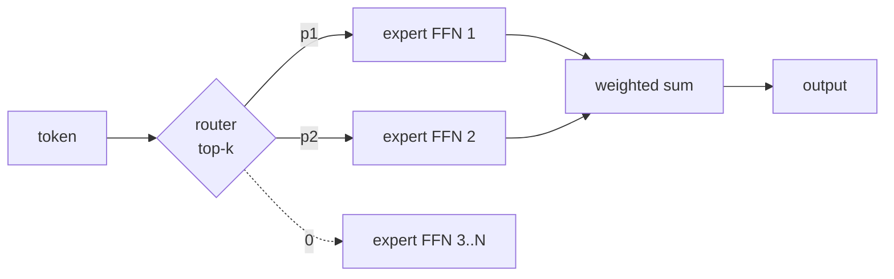

# Feedforward Network

The per-token MLP inside every [[Transformer]] block:

$$\text{FFN}(x) = W_2\,\sigma(W_1 x + b_1) + b_2, \qquad W_1 \in \mathbb{R}^{d_{ff} \times d}, \; W_2 \in \mathbb{R}^{d \times d_{ff}}$$

Notation:
- $d$ (also written $d_{model}$) — the **model/embedding dimension**: the width of every token vector flowing through the residual stream (e.g. 4096 in LLaMA-7B)
- $d_{ff}$ — the **FFN hidden (intermediate) dimension**: the width of the layer between $W_1$ and $W_2$ (e.g. 11008 in LLaMA-7B); shape is narrow → wide → narrow, so $W_1$ expands $d \to d_{ff}$ and $W_2$ projects back $d_{ff} \to d$
- **Expansion ratio** = $d_{ff}/d$ — how much wider the hidden layer is than the residual stream

Applied **position-wise** — each token independently, no token mixing (that's the [[Attention Mechanism]]'s job). Parameters: $2\,d\,d_{ff}$ dense, $3\,d\,d_{ff}$ gated ([[GLU Variants]]). At the standard 4× expansion this is **~2/3 of a transformer's non-embedding parameters** ([[Transformer Feed-Forward Layers Are Key-Value Memories (2021)|Geva 2021]]).

![[ffn-param-share.png]]

## ⚡ Adoption table

| FFN design | Introduced by | Flagship adopters | Reason |
| --- | --- | --- | --- |
| Dense ReLU, 4× | Vaswani et al. 2017 | **original Transformer, T5** | baseline convention |
| Dense GELU, 4× | — (BERT era) | **BERT, GPT-1/2/3, ViT** | smooth [[Activation Function]] wins at depth |
| SwiGLU, ~8/3–3.5× | [[GLU Variants Improve Transformer (2020)\|Shazeer 2020]] | **PaLM, LLaMA 1–3, Mistral, Qwen** | perplexity win at fixed params; faster convergence ([[The Devil is in the Condition Numbers (2026)\|NTK]]) |
| GEGLU, wide (8×) | [[GLU Variants Improve Transformer (2020)\|Shazeer 2020]] | **Gemma** | same gating family, GELU gate |
| MoE (routed FFN) | Shazeer 2017; scaled by [[Switch Transformers (2021)\|Fedus 2021]] | **Switch, GLaM, Mixtral 8×7B, DeepSeek-V2/V3, Qwen-MoE** | parameters ↑ without FLOPs ↑; 7× pre-training speedup at equal compute |
| Shared / single wide | [[One Wide Feedforward Is All You Need (2023)\|Pires 2023]] | research (MT) | per-layer FFNs are redundant; one wide shared FFN beats Transformer Big |
| Masked GLU | [[Masked Gated Linear Unit (2025)\|Tajima 2025]] | research | SwiGLU quality at 47% less FFN memory traffic |

## ⚡ Key numbers

- **Expansion ratio $d_{ff}/d$:** convention is **2–4×** ([[Revisiting the Shape Convention of Transformer Language Models (2026)|Liao 2026]]). Dense models: 4× (Transformer, BERT, GPT-3, ViT). SwiGLU models: **8/3 ≈ 2.67×** to hold parameters equal with 3 matrices (LLaMA-7B: 11008/4096 = 2.69×); practice drifted up to 3.5× (LLaMA-2-70B, Mistral) and 8× (Gemma-7B)
- **Parameter split per block:** attention $4d^2$ vs dense-4× FFN $8d^2$ → **FFN = 2/3**; MoE pushes it to ~95% (Mixtral: 8 experts × 3 × 3.5 = $84d^2$ vs $4d^2$)
- **MoE active vs total:** Mixtral 8×7B — 47B total / 13B active (top-2 of 8); DeepSeek-V3 — 671B total / 37B active
- **Gating cost:** GLU family needs **2× the memory reads** of dense FFN at inference (two matrices for gate+value) ([[Masked Gated Linear Unit (2025)|Tajima 2025]])

![[ffn-expansion-ratio.png]]

---

## What the FFN does — key-value memory

- Reading: rows of $W_1$ = **keys** (pattern detectors on the input), columns of $W_2$ = **values** (output-vocabulary distributions); hidden unit = memory slot; output = key-weighted sum of values ([[Transformer Feed-Forward Layers Are Key-Value Memories (2021)|Geva 2021]])
- **Results** (Geva 2021, GPT-style LMs): keys are human-interpretable; lower layers fire on shallow patterns (n-grams), upper layers on semantic ones; upper-layer values concentrate probability on the token *following* the pattern — FFN ≈ trained next-token lookup
- **Relocatable, not removable:** replacing all FFNs with persistent key-value vectors attended to by self-attention **matches standard transformer** LM performance ([[Augmenting Self-attention with Persistent Memory (2019)|Sukhbaatar 2019]]); but cutting FFN capacity outright degrades pre-training loss, and **3-layer FFNs with fewer blocks beat 2-layer FFNs with more blocks** at matched budget ([[Attention Is Not All You Need - FFN importance (2025)|Gerber 2025]], small scale)
- Division of labor: attention mixes information *across* tokens; FFN transforms/retrieves *per token* — knowledge-editing methods (ROME, MEMIT) exploit this by rewriting facts directly in FFN weights
- **Conclusion:** the FFN is the transformer's parametric memory; its capacity must exist somewhere, but its per-layer placement and 2-layer shape are conventions, not optima

## Expansion ratio $d_{ff}/d$

- Narrow-wide-narrow, ratio 2–4, is the near-universal convention ([[Revisiting the Shape Convention of Transformer Language Models (2026)|Liao 2026]]); outlier: T5-11B used 64× ($d_{ff}=65536$, $d=1024$)
- SwiGLU accounting: 3 matrices instead of 2 → param-matched width is $\tfrac{2}{3} \cdot 4 = 8/3 \approx 2.67\times$ ([[GLU Variants Improve Transformer (2020)|Shazeer 2020]]'s protocol); LLaMA-7B implements exactly this (2.69×)
- **Results against the convention:** deeper **hourglass** (wide-narrow-wide) sub-MLP stacks beat conventional FFNs up to 400M params, tie at 1B; reallocating saved FFN params to larger $d$ or to attention improves at matched budgets ([[Revisiting the Shape Convention of Transformer Language Models (2026)|Liao 2026]])
- **Conclusion:** ratio within 2–4 is a weak lever at scale; the attention:FFN split and FFN shape are the under-explored levers

## Gated FFN — SwiGLU / GLU variants

$$\text{FFN}_{\text{SwiGLU}}(x) = W_3\,[(W_1 x) \otimes \text{Swish}(W_2 x)]$$

- Two input projections, one gates the other element-wise; full family and per-variant results in [[GLU Variants]] and [[Activation Function]]
- **Results:** GEGLU/SwiGLU beat ReLU and GELU FFNs on T5 pre-training perplexity + GLUE/SuperGLUE at fixed params ([[GLU Variants Improve Transformer (2020)|Shazeer 2020]]); mechanism = smaller NTK condition number → faster optimization, ≈ no generalization-gap change ([[The Devil is in the Condition Numbers (2026)|Lyu 2026]])
- **Costs:** 2× memory reads at inference; recoverable — masked single-matrix variant SwiMGLU matches SwiGLU accuracy at 47% less memory traffic, 34% faster ([[Masked Gated Linear Unit (2025)|Tajima 2025]]). Side effect: gating rotates features off the neuron basis → neuron-level interpretability (the key-value reading above) degrades ([[Sparsity Moves Computation (2026)|Smithline 2026]])
- **Conclusion:** default in every current dense LLM; quality win is real, paid in inference bandwidth

## MoE — the routed FFN

- Replace the single FFN with $N$ expert FFNs + a learned router selecting top-$k$ per token → **parameters scale without FLOPs scaling**; only the FFN is worth routing because that's where the parameters are (chart above)
- **Results** ([[Switch Transformers (2021)|Fedus 2021]]): top-1 routing suffices; **7× pre-training speedup** vs T5-Base at equal FLOPs; 1.6T-parameter model trained, 4× speedup over T5-XXL; gains hold across 101 languages; needs auxiliary load-balancing loss + selective precision for stability
- **Adopters:** GLaM, **Mixtral 8×7B** (47B/13B active), **DeepSeek-V2/V3** (V3: 671B/37B active, 256 fine-grained + shared experts, top-8), Qwen-MoE
- **Deflationary result:** in small transformers, frozen *random* routing ≈ learned routing — the benefit comes largely from architectural sparsity, not router-learned specialization; MoE also shifts computation into attention ([[Sparsity Moves Computation (2026)|Smithline 2026]], toy scale)
- **Conclusion:** the scaling move when parameters are cheaper than FLOPs (training) or memory is cheaper than bandwidth (inference); costs: expert-parallel communication, load-balancing losses, fine-tuning instability

## Redundancy & sharing

- **Results** ([[One Wide Feedforward Is All You Need (2023)|Pires 2023]], MT encoder-decoders): drop all decoder FFNs + share one FFN across encoder layers → large param cut, modest accuracy drop; re-spend savings on one **wider shared FFN** → **beats Transformer Big on accuracy *and* latency**
- Per-layer FFNs learn substantially overlapping functions; capacity > per-layer individuality (at MT scale; LLM-scale evidence thin)
- **Conclusion:** FFN parameter count matters more than where it sits — consistent with MoE (add capacity) and sharing (dedupe capacity) both working

---

## Related

- Component of the [[Transformer]] block; contrast with [[Attention Mechanism]] — mixes within a token vs across tokens
- Non-linearity supplied by the [[Activation Function]]; gated variants in [[GLU Variants]]
- [[Mixture of Experts]] = this layer, routed
- The transformer's parametric memory — target of knowledge editing
- FFN width/params dominate [[KV Cache]]-free inference cost per token

## Sources

- [[Transformer Feed-Forward Layers Are Key-Value Memories (2021)]] — role/interpretability anchor; 2/3-of-params fact
- [[Augmenting Self-attention with Persistent Memory (2019)]] — FFN relocatable into attention
- [[Attention Is Not All You Need - FFN importance (2025)]] — FFN capacity load-bearing; 3-layer > 2-layer (small scale)
- [[Revisiting the Shape Convention of Transformer Language Models (2026)]] — 2–4× convention; hourglass results
- [[GLU Variants Improve Transformer (2020)]] — SwiGLU/GEGLU wins; 8/3 protocol
- [[The Devil is in the Condition Numbers (2026)]] — gating = NTK conditioning
- [[Masked Gated Linear Unit (2025)]] — gating's 2× memory cost + fix
- [[Switch Transformers (2021)]] — MoE at scale: 7× speedup, 1.6T params
- [[Sparsity Moves Computation (2026)]] — random ≈ learned routing; MoE/GLU side effects (toy scale)
- [[One Wide Feedforward Is All You Need (2023)]] — cross-layer FFN redundancy

---
Part of the [[Transformer]] cluster
