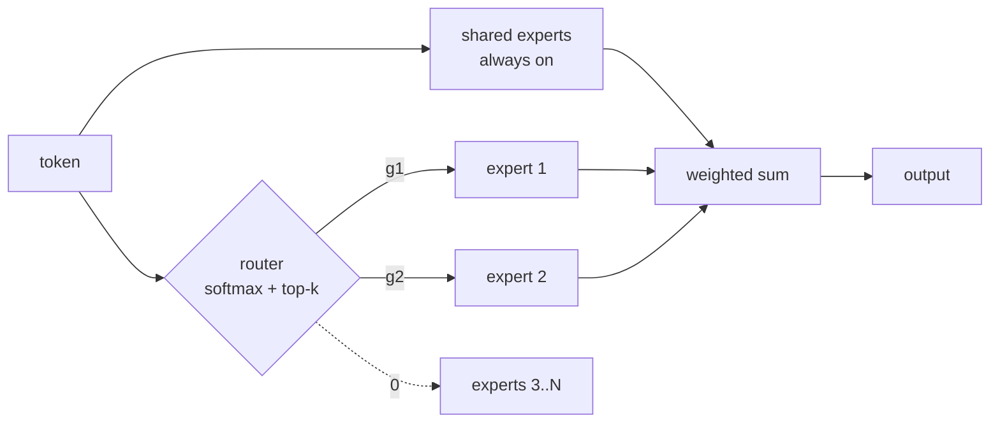

# Mixture of Experts

Replace the single [[Feedforward Network]] in each [[Transformer]] block with $N$ expert FFNs and a learned **router** that activates only $K$ of them per token:

$$y = \sum_{i \in \text{TopK}(g(x))} g_i(x)\, E_i(x), \qquad g(x) = \text{softmax}(W_r\, x)$$

Notation:
- $E_i$ — expert $i$: an independent FFN (usually SwiGLU, see [[GLU Variants]]); $N$ = total experts, $K$ = active per token
- $g_i(x)$ — router weight: $W_r \in \mathbb{R}^{N \times d}$ scores the token, softmax normalizes, top-$K$ truncates; the router adds only $N \cdot d$ parameters (negligible)
- **Activation ratio** $N_a/N$ — active params ÷ total params. Concretely: Mixtral $13/47 = 27.7\%$, DeepSeek-V3 $37/671 = 5.5\%$
- **Granularity** $G$ — expert hidden width relative to the dense FFN: each expert has $d_{expert} = d_{ff}/G$ ([[Scaling Laws for Fine-Grained Mixture of Experts (2024)|Krajewski 2024]]'s definition). $G=1$: Mixtral-style big experts; DeepSeek-V3: 256 fine-grained experts, top-8
- **Shared experts** $K_s$ — experts that bypass the router and run on *every* token (DeepSeek-V3: $K_s = 1$)
- **Expert capacity** $C = \text{CF} \cdot \frac{T \cdot K}{N}$ — fixed token buffer per expert ($T$ = tokens in batch, CF = capacity factor, typically 1.0–1.25); tokens beyond $C$ are dropped

**Purpose:** parameters and FLOPs become **independent axes** ([[Unified Scaling Laws for Routed Language Models (2022)|Clark 2022]]): forward FLOPs per token ≈ $2 N_a$ regardless of $N$ (a matmul with $P$ params costs ~$2P$ FLOPs, and only active params multiply). Knowledge capacity scales with total params; per-token cost scales with active params. Only the FFN is worth routing — it holds ~2/3 of block weights (dense) and ~95% (MoE); see the param-share chart in [[Feedforward Network]].

![[moe-active-vs-total.png]]

## ⚡ Adoption table

| Variant | Introduced by | Flagship adopters | Reason |
| --- | --- | --- | --- |
| Sparse top-k + aux. balancing losses | [[Outrageously Large Neural Networks (2017)\|Shazeer 2017]] | 137B LSTM-era models | first working conditional computation; >1000× capacity |
| Transformer-FFN MoE, top-2 + capacity factor | [[GShard (2020)\|Lepikhin 2020]] | **600B multilingual MT** (2048 TPUs, 4 days) | first MoE inside the transformer; the baseline template |
| Top-1 ("switch") routing | [[Switch Transformers (2021)\|Fedus 2021]] | **Switch-C (1.6T)** | routing simplification; 7× pre-training speedup at equal FLOPs |
| + router z-loss (stability) | [[ST-MoE (2022)\|Zoph 2022]] | **ST-MoE-32B (269B)**; PaLM/Qwen-MoE lineages | first sparse transfer-learning SOTA; logit control without quality tax |
| Expert-choice routing | [[Mixture-of-Experts with Expert Choice Routing (2022)\|Zhou 2022]] | encoders & vision MoEs | balance by construction, no aux loss; >2× faster convergence; blocked from causal decode |
| Decoder-only, top-2 of 64 | [[GLaM (2021)\|Du 2021]] | **GLaM (1.2T/97B)** | beat GPT-3 at 1/3 training energy, 1/2 inference FLOPs |
| Coarse: 8 big experts, top-2 | [[Mixtral of Experts (2024)\|Jiang 2024]] | **Mixtral 8×7B (47B/13B)** | open weights; ≥ LLaMA-2-70B & GPT-3.5 at 13B active |
| Fine-grained + shared experts | [[DeepSeekMoE (2024)\|Dai 2024]] | **DeepSeek-V2/V3, Qwen-MoE, Ling** | expert specialization; LLaMA-2-7B quality at 40% compute |
| + loss-free balancing | [[DeepSeek-V3 Technical Report (2024)\|DeepSeek-AI 2024]] | **DeepSeek-V3 (671B/37B)** | bias-adjustment replaces auxiliary losses; frontier at $5.6M train cost |
| Dropless / block-sparse kernels | [[MegaBlocks (2022)\|Gale 2022]] | Databricks-lineage training stacks | no token dropping; +40% over prior MoE stacks |
| Upcycling (dense → MoE init) | [[Sparse Upcycling (2022)\|Komatsuzaki 2022]] | Nemotron-family, many mid-scale MoEs | copy dense FFN into every expert + fresh router; beats dense parent at ~50% extra compute |
| Soft MoE (differentiable) | [[From Sparse to Soft Mixtures of Experts (2023)\|Puigcerver 2023]] | vision (ViT-scale) | no discrete routing at all — no balancing losses, no dead experts; blocked from causal LMs |

## ⚡ Scaling laws — the ratios and what happens when you move them

- **The functional form.** Dense models obey $L(N,D) = c + a N^{-\alpha} + b D^{-\beta}$ (Chinchilla-style). [[Scaling Laws for Fine-Grained Mixture of Experts (2024)|Krajewski 2024]] extends this to MoE with granularity as a third variable:
$$L(N, D, G) \;=\; c \;+\; \left(\frac{g}{G^{\gamma}} + a\right) N^{-\alpha} \;+\; b\, D^{-\beta}$$
  — granularity multiplies down the model-size term: higher $G$ lowers loss at fixed $N, D$, with power-law diminishing returns ($G^{-\gamma}$). [[Unified Scaling Laws for Routed Language Models (2022)|Clark 2022]]'s earlier bilinear fit in $(\log N, \log E)$ over 5 orders of magnitude yields an **Effective Parameter Count** $\bar N$ (the dense size an $E$-expert model behaves like) — but predicted routing gains vanish near ~900B because expert size was fixed at $G=1$; Krajewski shows tuning $G$ reverses this: **the MoE-vs-dense gap widens with scale**
- **Active/total ratio $N_a/N$:** an **optimal sparsity exists** per constraint regime — neither dense nor maximal ([[Parameters vs FLOPs - Optimal Sparsity for MoE (2025)|Abnar 2025]]); the optimum **decreases as $N$ grows** ([[Towards a Comprehensive Scaling Law of Mixture-of-Experts (2025)|Zhao 2025]], 446 controlled runs, joint law over $D, N, N_a, G, S$). Industry matches: Mixtral 27.7% → GLaM 8.1% → DeepSeek-V2 8.9% → DeepSeek-V3 **5.5%** (chart above). Predictive version: **Efficiency Leverage** (compute multiplier over quality-matched dense) follows power laws in activation ratio and compute budget — validated by **Ling-mini-beta: 0.85B active ≈ 6.1B dense on identical 1T tokens, >7× less compute** ([[Towards Greater Leverage - Scaling Laws for Efficient MoE (2025)|Tian 2025]], 300+ models)
- **Shared/total ratio $S$:** optimal $S$ and optimal active-expert count are **independent of architecture and data size** — tune once at small scale, transfer up ([[Towards a Comprehensive Scaling Law of Mixture-of-Experts (2025)|Zhao 2025]]). Mechanism: shared experts absorb common knowledge so routed experts stop learning it redundantly; ablation evidence in [[DeepSeekMoE (2024)|Dai 2024]] (2B model: fine-grained + shared matches GShard with **1.5× its expert params and compute**). DeepSeek-V3: $K_s{=}1$ shared + 256 routed, top-8
- **Granularity:** $G{=}1$ (expert = dense FFN size, the GShard/Mixtral convention) is **suboptimal at almost every compute budget** ([[Scaling Laws for Fine-Grained Mixture of Experts (2024)|Krajewski 2024]]); but not monotone — granularity is a **non-linear modulator with an optimal range**, too fine hurts ([[Towards Greater Leverage - Scaling Laws for Efficient MoE (2025)|Tian 2025]]). Theory: at matched active params, many-small-experts represents functions few-big-experts need **exponentially** more capacity for; the mixture count $\binom{mN}{mK}$ grows combinatorially in slicing factor $m$ ([[The Power of Fine-Grained Experts (2025)|Boix-Adserà 2025]])
- **Expert count under a serving constraint:** loss-optimal says "keep adding experts" (training FLOPs stay flat), but serving cost doesn't — **4–8 experts is most serving-efficient at matched quality (costing 2.5–3.5× more to train); 16/32 experts on a 70–85% smaller model + more data wins under a training budget** ([[Toward Inference-optimal Mixture-of-Expert LLMs (2024)|Yun 2024]])
- **Compute-efficiency headline:** MoE matches dense at **~4× less compute** at modest budgets, narrowing but not closing at 1.1T ([[Efficient Large Scale Language Modeling with Mixtures of Experts (2021)|Artetxe 2021]]); exception — **full fine-tuning**, where MoE underperforms dense (same paper)

---

## How routing works

- Router = one linear layer + softmax + top-$K$ truncation; trained end-to-end with the model

## Training & load balancing — the non-differentiability problem

**The core difficulty:** top-$K$ selection is a **discrete, non-differentiable** operation. Gradients flow through the gate *values* $g_i(x)$ of the experts that were selected — but there is **no gradient signal through the selection itself**: an unselected expert receives zero gradient, so nothing ever tells the router "expert 7 *would have been* better." Training relies on the selected experts' gates being differentiable and on exploration; the un-taken paths are invisible.

**The failure mode this causes — router collapse (rich-get-richer):** early in training, whichever experts happen to receive tokens improve; improved experts get higher router scores; higher scores → more tokens → more improvement. The loop concentrates all traffic on a few experts while the rest never train (dead experts) — the mixture degenerates toward a single dense model, wasting the parameter budget. Imbalance also has a *systems* cost: overloaded experts stall the batch or drop tokens (capacity factor, see Hardware below).

**The solutions, in historical order:**

1. **Noisy top-k gating + auxiliary load-balancing loss** ([[Outrageously Large Neural Networks (2017)|Shazeer 2017]]): perturb the router logits before top-k,
$$H_i(x) = (x W_g)_i + \varepsilon \cdot \text{softplus}\big((x W_{noise})_i\big), \quad \varepsilon \sim \mathcal{N}(0,1)$$
so borderline experts occasionally win a token and get a training signal (forced exploration). Balance is enforced by the auxiliary loss adopted by [[Switch Transformers (2021)|Switch]] as
$$\mathcal{L}_{aux} = \alpha \cdot N \sum_{i=1}^{N} f_i \, P_i, \qquad f_i = \tfrac{\#\{\text{tokens routed to } i\}}{T}, \quad P_i = \tfrac{1}{T}\sum_x g_i(x), \quad \alpha \approx 10^{-2}$$
$f_i$ is non-differentiable (a count) but $P_i$ is differentiable — the product pushes router *probabilities* away from overloaded experts. Minimum $\mathcal{L}_{aux} = \alpha$ exactly at uniform load ($f_i = P_i = 1/N$)
2. **Capacity factor** ([[GShard (2020)|Lepikhin 2020]]): enforce balance *mechanically* — each expert processes at most $C = \text{CF} \cdot TK/N$ tokens; overflow tokens **skip the FFN entirely** (pass through the residual connection unchanged). Static hardware shapes, but imbalance becomes silent quality loss; at CF = 1.0, a 2×-overloaded expert drops half its tokens ([[MegaBlocks (2022)|Gale 2022]] later removed the need)
3. **Top-1 + selective precision** ([[Switch Transformers (2021)|Fedus 2021]]): $K{=}1$ works with $\mathcal{L}_{aux}$ above; router computed in **fp32** while the rest of the model runs bf16 — the routing softmax's exponentials amplify bf16 round-off into divergence
4. **Router z-loss** ([[ST-MoE (2022)|Zoph 2022]]): a second, *distinct* auxiliary loss on logit magnitude,
$$\mathcal{L}_z = \frac{1}{T}\sum_{t=1}^{T}\Big(\log \sum_{j=1}^{N} e^{x_j^{(t)}}\Big)^{2}, \qquad c_z \approx 10^{-3}$$
Large logits → large round-off in $e^{x}$ → instability; $\mathcal{L}_z$ shrinks them. **Numerics, not load** — complements $\mathcal{L}_{aux}$, and among the stability fixes ST-MoE swept it was the one that didn't degrade quality. Standard in PaLM/Qwen-MoE-era stacks
5. **Expert-choice routing — balance by construction** ([[Mixture-of-Experts with Expert Choice Routing (2022)|Zhou 2022]]): transpose the assignment — from the score matrix $S = \text{softmax}(XW_r) \in \mathbb{R}^{T \times N}$, **each expert takes its top-$C$ tokens** (columns pick rows) with $C = TK/N$ fixed. Every expert is exactly full → no balancing loss exists; tokens receive a *variable* number of experts (0 to many) in proportion to how many experts want them. **>2× faster convergence** than Switch top-1 and GShard top-2 at equal compute; beats dense T5 on 7/11 GLUE/SuperGLUE tasks at lower activation cost. The catch: experts compare tokens **across the whole batch** — at autoregressive decode future tokens don't exist and cross-example competition leaks information → unusable in decoder LLMs; thrives in encoders/vision
6. **Auxiliary-loss-free balancing** ([[DeepSeek-V3 Technical Report (2024)|DeepSeek-AI 2024]]): $\mathcal{L}_{aux}$'s gradient *interferes* with the LM gradient (the model partly optimizes "spread tokens" instead of "predict tokens"). V3 splits selection from weighting: top-K is computed on **biased scores** $s_i + b_i$, but the gate weight uses the *unbiased* $s_i$ — so $b_i$ has **no gradient path at all**. After each step: $b_i \mathrel{-}= \gamma$ if expert $i$ was overloaded, $b_i \mathrel{+}= \gamma$ if underloaded (γ = fixed bias-update speed). Balancing becomes a control loop outside the loss; V3 trained 14.8T tokens with no loss spikes
7. **Fully differentiable routing — dissolve the problem** ([[From Sparse to Soft Mixtures of Experts (2023)|Puigcerver 2023]]): **Soft MoE** removes discreteness: each of $p$ slots per expert computes a softmax-weighted **mixture of all $T$ tokens** ($\tilde X = D^{\top} X$, dispatch weights $D$ = softmax over tokens), experts process the mixtures, outputs are combined back per-token by a second softmax over slots. Everything is smooth → ordinary backprop, no balancing losses, no dead experts, no dropping. Vision results: beats dense ViTs and sparse MoEs; Soft MoE Huge/14, 128 experts = **>40× ViT-Huge params at +2% inference time**. Blocked from causal LMs: each slot mixes *future* tokens → breaks autoregressive masking

**Does learned routing actually learn anything?** Evidence in both directions:
- **For:** theory proves the router can learn cluster-center features that divide a provably-hard problem into per-cluster sub-problems single experts can solve — data cluster structure + expert non-linearity are the pivotal ingredients, and this is *why the mixture doesn't collapse* when properly balanced ([[Towards Understanding the Mixture-of-Experts Layer (2022)|Chen 2022]]); fine-grained experts specialize measurably at scale ([[DeepSeekMoE (2024)|Dai 2024]] ablations)
- **Against:** in small transformers, frozen *random* routing ≈ learned routing — much of the benefit is architectural sparsity itself ([[Sparsity Moves Computation (2026)|Smithline 2026]], toy scale)
- **Observed in trained LLMs:** routers systematically prefer experts with **larger output norms**; expert diversity increases with depth (last layer an outlier) ([[A Closer Look into Mixture-of-Experts in LLMs (2024)|Lo 2024]]) — real routers are partly magnitude-driven, not purely semantic

## Results — the headline numbers

- **>1000× capacity** at minor efficiency loss; 137B params in 2017 ([[Outrageously Large Neural Networks (2017)|Shazeer 2017]])
- **7× pre-training speedup** vs T5-Base at equal FLOPs; first 1.6T-param model ([[Switch Transformers (2021)|Fedus 2021]])
- **GLaM 1.2T beats GPT-3** zero/one-shot at 1/3 the training energy and half the inference FLOPs ([[GLaM (2021)|Du 2021]])
- **Mixtral 47B/13B ≥ LLaMA-2-70B and GPT-3.5** across benchmarks ([[Mixtral of Experts (2024)|Jiang 2024]])
- **DeepSeek-V3 671B/37B**: frontier-competitive at 14.8T tokens for 2.788M H800 GPU-hours, no loss spikes ([[DeepSeek-V3 Technical Report (2024)|DeepSeek-AI 2024]])

## Hardware & systems

- **The core systems problem:** experts live on different GPUs (**expert parallelism**) → every MoE layer needs two **all-to-all communications** per pass (scatter tokens to experts, gather results); router load imbalance stalls whole batches
- **Capacity factor & token dropping:** classic kernels need fixed shapes → fixed per-expert buffers → overflow tokens *dropped*, underflow *padded*. **Block-sparse kernels remove the tradeoff**: dropless MoE at +40% speed over prior stacks, 2.4× over dense Megatron training ([[MegaBlocks (2022)|Gale 2022]])
- **Training vs inference asymmetry:** training amortizes weight reads over huge batches (compute-bound, MoE wins); decoding fragments batches across experts → poor weight reuse, and the resident expert pool crowds [[KV Cache]] HBM — a quality-matched *dense* model can have **4.5× serving throughput** at 128k context ([[The qs Inequality (2026)|Adhinarayanan 2026]]); mitigations: wide batching, expert offload, distill-to-dense
- **Practice:** MoE ≈ a *training-time* and *capacity* optimization; serving economics decide $K$ and $N$ as much as loss curves do ([[Toward Inference-optimal Mixture-of-Expert LLMs (2024)|Yun 2024]])

## Known costs

- Expert-parallel communication; load-balancing machinery; training instability at low precision ([[Switch Transformers (2021)|Fedus 2021]] needed selective fp32)
- **Fine-tuning fragility** — MoE underperforms dense under full fine-tuning ([[Efficient Large Scale Language Modeling with Mixtures of Experts (2021)|Artetxe 2021]])
- Memory footprint: all $N$ experts resident at inference even though $K$ run

---

## Related

- Routed variant of the [[Feedforward Network]] — the FFN is what's worth routing (it's where the parameters are)
- Component of the [[Transformer]]; experts are usually SwiGLU FFNs ([[GLU Variants]])
- Interacts with [[KV Cache]] memory at serving time
- [[Multi-Head Latent Attention]] — DeepSeek's companion technique (KV compression)

## Sources

- [[Outrageously Large Neural Networks (2017)]] — origin: sparse gating, load balancing
- [[GShard (2020)]] — first transformer MoE; top-2 + capacity factor template
- [[Switch Transformers (2021)]] — top-1 routing, 7× speedup, 1.6T
- [[ST-MoE (2022)]] — router z-loss; first sparse transfer SOTA
- [[Mixture-of-Experts with Expert Choice Routing (2022)]] — balance by construction; causality catch
- [[GLaM (2021)]] — decoder-only proof point vs GPT-3
- [[Efficient Large Scale Language Modeling with Mixtures of Experts (2021)]] — 4× compute efficiency; fine-tuning caveat
- [[Unified Scaling Laws for Routed Language Models (2022)]] — effective parameter count; early diminishing-returns fit
- [[Scaling Laws for Fine-Grained Mixture of Experts (2024)]] — granularity laws; gap widens with scale
- [[Parameters vs FLOPs - Optimal Sparsity for MoE (2025)]] — optimal activation ratio exists
- [[Towards a Comprehensive Scaling Law of Mixture-of-Experts (2025)]] — joint law over $N, N_a, G, S, D$
- [[Towards Greater Leverage - Scaling Laws for Efficient MoE (2025)]] — Efficiency Leverage; Ling-mini 7× validation
- [[Toward Inference-optimal Mixture-of-Expert LLMs (2024)]] — expert count under serving constraints
- [[The Power of Fine-Grained Experts (2025)]] — exponential expressivity separation
- [[DeepSeekMoE (2024)]] — fine-grained + shared experts
- [[Mixtral of Experts (2024)]] — open-weights coarse MoE
- [[DeepSeek-V2 (2024)]] — 236B/21B; MLA companion
- [[DeepSeek-V3 Technical Report (2024)]] — 671B/37B; loss-free balancing
- [[From Sparse to Soft Mixtures of Experts (2023)]] — fully differentiable routing (vision)
- [[Sparse Upcycling (2022)]] — dense checkpoint → MoE init
- [[Towards Understanding the Mixture-of-Experts Layer (2022)]] — why routing works / doesn't collapse (theory)
- [[A Closer Look into Mixture-of-Experts in LLMs (2024)]] — observed router behavior (output norms, depth diversity)
- [[MegaBlocks (2022)]] — dropless block-sparse kernels
- [[The qs Inequality (2026)]] — inference double penalty
- [[Sparsity Moves Computation (2026)]] — random ≈ learned routing (toy scale)

---
Part of the [[Transformer]] cluster
