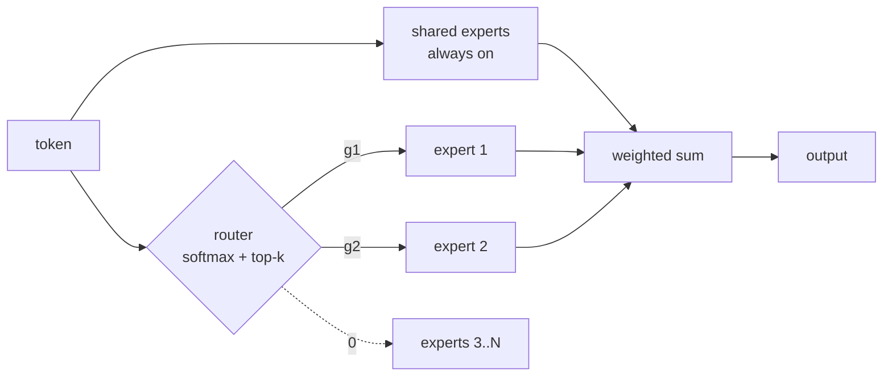

# Mixture of Experts

Replace the single [[Feedforward Network]] in each [[Transformer]] block with $N$ expert FFNs and a learned **router** that activates only $K$ of them per token:

$$y = \sum_{i \in \text{TopK}(g(x))} g_i(x)\, E_i(x), \qquad g(x) = \text{softmax}(W_r\, x)$$

Notation:
- $E_i$ — expert $i$: an independent FFN (usually SwiGLU, see [[GLU Variants]]); $N$ = total experts, $K$ = active per token
- $g_i(x)$ — router weight: softmax over a linear scoring of the token, truncated to the top $K$
- **Activation ratio** $N_a/N$ — active params ÷ total params (the sparsity knob)
- **Granularity** $G$ — how finely the FFN budget is sliced into experts (many-small vs few-big)
- **Shared experts** $K_s$ — experts that bypass the router and run on *every* token

**Purpose:** parameters and FLOPs become **independent axes** ([[Unified Scaling Laws for Routed Language Models (2022)|Clark 2022]]). Knowledge capacity scales with total params; per-token cost scales with active params. Only the FFN is worth routing — it holds ~2/3 of block weights (dense) and ~95% (MoE); see the param-share chart in [[Feedforward Network]].

![[moe-active-vs-total.png]]

## ⚡ Adoption table

| Variant | Introduced by | Flagship adopters | Reason |
| --- | --- | --- | --- |
| Sparse top-k + aux. balancing losses | [[Outrageously Large Neural Networks (2017)\|Shazeer 2017]] | 137B LSTM-era models | first working conditional computation; >1000× capacity |
| Top-1 ("switch") routing | [[Switch Transformers (2021)\|Fedus 2021]] | **Switch-C (1.6T)** | routing simplification; 7× pre-training speedup at equal FLOPs |
| Decoder-only, top-2 of 64 | [[GLaM (2021)\|Du 2021]] | **GLaM (1.2T/97B)** | beat GPT-3 at 1/3 training energy, 1/2 inference FLOPs |
| Coarse: 8 big experts, top-2 | [[Mixtral of Experts (2024)\|Jiang 2024]] | **Mixtral 8×7B (47B/13B)** | open weights; ≥ LLaMA-2-70B & GPT-3.5 at 13B active |
| Fine-grained + shared experts | [[DeepSeekMoE (2024)\|Dai 2024]] | **DeepSeek-V2/V3, Qwen-MoE, Ling** | expert specialization; LLaMA-2-7B quality at 40% compute |
| + loss-free balancing | [[DeepSeek-V3 Technical Report (2024)\|DeepSeek-AI 2024]] | **DeepSeek-V3 (671B/37B)** | bias-adjustment replaces auxiliary losses; frontier at $5.6M train cost |
| Dropless / block-sparse kernels | [[MegaBlocks (2022)\|Gale 2022]] | Databricks-lineage training stacks | no token dropping; +40% over prior MoE stacks |
| Upcycling (dense → MoE init) | Komatsuzaki 2022 | Nemotron-family, many mid-scale MoEs | reuse sunk dense-training cost; beats continued dense training |

## ⚡ Scaling laws — the ratios and what happens when you move them

- **Active/total ratio $N_a/N$:** an **optimal sparsity exists** for each constraint regime — neither dense nor maximal sparsity ([[Parameters vs FLOPs - Optimal Sparsity for MoE (2025)|Abnar 2025]]); and the optimum **drifts sparser as total size grows** ([[Towards a Comprehensive Scaling Law of Mixture-of-Experts (2025)|Zhao 2025]], 446 controlled runs). The industry matches: Mixtral 27.7% → GLaM 8.1% → DeepSeek-V2 8.9% → DeepSeek-V3 **5.5%** (chart above)
- **Shared/total ratio $S$:** optimal $S$ (and optimal active-expert count $G$) are **independent of architecture and data size** — tune once at small scale, transfer up ([[Towards a Comprehensive Scaling Law of Mixture-of-Experts (2025)|Zhao 2025]]). Purpose of shared experts: absorb common knowledge so routed experts stop learning it redundantly ([[DeepSeekMoE (2024)|Dai 2024]]); DeepSeek-V3 runs 256 routed + shared, top-8
- **Granularity:** making each expert the size of the dense FFN — the original convention — is **suboptimal at almost every budget**; finer slicing wins, and with granularity tuned, **MoE beats dense at all scales with a gap that *widens*** ([[Scaling Laws for Fine-Grained Mixture of Experts (2024)|Krajewski 2024]]) — overturning the earlier diminishing-returns fit of [[Unified Scaling Laws for Routed Language Models (2022)|Clark 2022]] (who had fixed expert size). Theory: expressivity separation in granularity is **exponential** ([[The Power of Fine-Grained Experts (2025)|Boix-Adserà 2025]]) — $\binom{mN}{mK}$ expert combinations grow combinatorially with slicing $m$
- **Expert count under a serving constraint:** loss-optimal says "keep adding experts" (training FLOPs stay flat), but serving cost doesn't — **4–8 experts is most serving-efficient at matched quality (costing 2.5–3.5× more to train); 16/32 experts on a 70–85% smaller model + more data wins under a training budget** ([[Toward Inference-optimal Mixture-of-Expert LLMs (2024)|Yun 2024]])
- **Compute-efficiency headline:** MoE matches dense at **~4× less compute** at modest budgets, narrowing but not closing at 1.1T ([[Efficient Large Scale Language Modeling with Mixtures of Experts (2021)|Artetxe 2021]]); exception — **full fine-tuning**, where MoE underperforms dense (same paper)

---

## How routing works

- Router = one linear layer + softmax + top-$K$ truncation; trained end-to-end with the model. Non-differentiability of top-$K$ and **router collapse** (all tokens → one expert) are the classic failure modes
- Fixes: noisy gating + auxiliary **load-balancing loss** ([[Outrageously Large Neural Networks (2017)|Shazeer 2017]]); top-1 suffices with selective precision ([[Switch Transformers (2021)|Fedus 2021]]); **auxiliary-loss-free balancing** via per-expert bias adjustment ([[DeepSeek-V3 Technical Report (2024)|DeepSeek-AI 2024]]) — removes the gradient interference of balancing losses
- **Deflationary result:** in small transformers, frozen *random* routing ≈ learned routing — much of the benefit is architectural sparsity itself, not learned specialization; MoE also shifts computation into attention ([[Sparsity Moves Computation (2026)|Smithline 2026]], toy scale). Counterpoint at LLM scale: fine-grained experts do specialize measurably ([[DeepSeekMoE (2024)|Dai 2024]] ablations)

## Results — the headline numbers

- **>1000× capacity** at minor efficiency loss; 137B params in 2017 ([[Outrageously Large Neural Networks (2017)|Shazeer 2017]])
- **7× pre-training speedup** vs T5-Base at equal FLOPs; first 1.6T-param model ([[Switch Transformers (2021)|Fedus 2021]])
- **GLaM 1.2T beats GPT-3** zero/one-shot at 1/3 the training energy and half the inference FLOPs ([[GLaM (2021)|Du 2021]])
- **Mixtral 47B/13B ≥ LLaMA-2-70B and GPT-3.5** across benchmarks ([[Mixtral of Experts (2024)|Jiang 2024]])
- **DeepSeek-V3 671B/37B**: frontier-competitive at 14.8T tokens for 2.788M H800 GPU-hours, no loss spikes ([[DeepSeek-V3 Technical Report (2024)|DeepSeek-AI 2024]])

## Hardware & systems

- **The core systems problem:** experts live on different GPUs (**expert parallelism**) → every MoE layer needs two **all-to-all communications** per pass (scatter tokens to experts, gather results); router load imbalance stalls whole batches
- **Capacity factor & token dropping:** classic kernels need fixed shapes → fixed per-expert buffers → overflow tokens *dropped*, underflow *padded*. **Block-sparse kernels remove the tradeoff**: dropless MoE at +40% speed over prior stacks, 2.4× over dense Megatron training ([[MegaBlocks (2022)|Gale 2022]])
- **Training vs inference asymmetry:** training amortizes weight reads over huge batches (compute-bound, MoE wins); decoding fragments batches across experts → poor weight reuse, and the resident expert pool crowds [[KV Cache]] HBM — a quality-matched *dense* model can have **4.5× serving throughput** at 128k context ([[The qs Inequality (2026)|Adhinarayanan 2026]]); mitigations: wide batching, expert offload, distill-to-dense
- **Practice:** MoE ≈ a *training-time* and *capacity* optimization; serving economics decide $K$ and $N$ as much as loss curves do ([[Toward Inference-optimal Mixture-of-Expert LLMs (2024)|Yun 2024]])

## Known costs

- Expert-parallel communication; load-balancing machinery; training instability at low precision ([[Switch Transformers (2021)|Fedus 2021]] needed selective fp32)
- **Fine-tuning fragility** — MoE underperforms dense under full fine-tuning ([[Efficient Large Scale Language Modeling with Mixtures of Experts (2021)|Artetxe 2021]])
- Memory footprint: all $N$ experts resident at inference even though $K$ run

---

## Related

- Routed variant of the [[Feedforward Network]] — the FFN is what's worth routing (it's where the parameters are)
- Component of the [[Transformer]]; experts are usually SwiGLU FFNs ([[GLU Variants]])
- Interacts with [[KV Cache]] memory at serving time
- [[Multi-Head Latent Attention]] — DeepSeek's companion technique (KV compression)

## Sources

- [[Outrageously Large Neural Networks (2017)]] — origin: sparse gating, load balancing
- [[Switch Transformers (2021)]] — top-1 routing, 7× speedup, 1.6T
- [[GLaM (2021)]] — decoder-only proof point vs GPT-3
- [[Efficient Large Scale Language Modeling with Mixtures of Experts (2021)]] — 4× compute efficiency; fine-tuning caveat
- [[Unified Scaling Laws for Routed Language Models (2022)]] — effective parameter count; early diminishing-returns fit
- [[Scaling Laws for Fine-Grained Mixture of Experts (2024)]] — granularity laws; gap widens with scale
- [[Parameters vs FLOPs - Optimal Sparsity for MoE (2025)]] — optimal activation ratio exists
- [[Towards a Comprehensive Scaling Law of Mixture-of-Experts (2025)]] — joint law over $N, N_a, G, S, D$
- [[Toward Inference-optimal Mixture-of-Expert LLMs (2024)]] — expert count under serving constraints
- [[The Power of Fine-Grained Experts (2025)]] — exponential expressivity separation
- [[DeepSeekMoE (2024)]] — fine-grained + shared experts
- [[Mixtral of Experts (2024)]] — open-weights coarse MoE
- [[DeepSeek-V2 (2024)]] — 236B/21B; MLA companion
- [[DeepSeek-V3 Technical Report (2024)]] — 671B/37B; loss-free balancing
- [[MegaBlocks (2022)]] — dropless block-sparse kernels
- [[The qs Inequality (2026)]] — inference double penalty
- [[Sparsity Moves Computation (2026)]] — random ≈ learned routing (toy scale)

---
Part of the [[Transformer]] cluster
