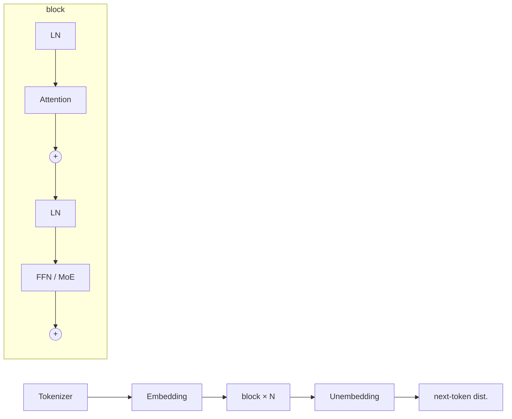

# Transformer

The dominant neural sequence architecture ([[Attention Is All You Need (2017)|Vaswani 2017]]): stacked blocks of [[Attention Mechanism|attention]] (mix information *across* positions) and [[Feedforward Network|FFN]] (transform *within* each position), glued by [[Residual Connection|residuals]] and [[Normalization|normalization]]. Its winning property in 2017 wasn't accuracy per se but **parallelism**: no recurrence → the whole sequence trains at once (28.4 BLEU En-De in 3.5 days on 8 GPUs — a fraction of prior SOTA compute).

## The forward pass — every step now has its own note

1. [[Tokenizer]] — text → ids (BPE)
2. [[Embedding]] — ids → vectors; the first write into the residual stream
3. [[Positional Encoding]] — position injection (modern: RoPE inside attention)
4. $N \times$ **block** (pre-LN form):
$$h' = h + \text{Attn}(\text{LN}(h)) \qquad h'' = h' + \text{FFN}(\text{LN}(h'))$$
   - [[Attention Mechanism]] — with variants [[Grouped-Query Attention]], [[Multi-Head Latent Attention]], [[Sliding Window Attention]], [[Linear Attention]]; computed via [[Flash Attention]]; decode state = [[KV Cache]]
   - [[Feedforward Network]] — usually [[GLU Variants|SwiGLU]] with an [[Activation Function]]; routed at scale = [[Mixture of Experts]]
   - [[Normalization]] (RMSNorm, pre-LN) and [[Residual Connection]]
5. [[Unembedding]] — final state → logits → softmax → sampling

**The residual-stream reading:** blocks *add into* a shared stream rather than transform it — attention routes information between positions, the FFN retrieves/writes per-token knowledge ([[Transformer Feed-Forward Layers Are Key-Value Memories (2021)|Geva 2021]]), and [[Unembedding|the logit lens]] can read the stream at any depth ([[Identity Mappings in Deep Residual Networks (2016)|identity math]]).

## ⚡ Parameter & compute anatomy (per block, dense 4× FFN)

- Attention $4d^2$ (QKVO) + FFN $8d^2$ → **FFN = 2/3 of block weights**; MoE pushes to ~95% ([[Feedforward Network]] charts)
- Attention: $O(T^2 d)$ time, the only cross-token path; FFN: $O(T d\, d_{ff})$, position-wise
- Training/prefill = compute-bound GEMMs; decode = bandwidth-bound [[KV Cache]] reads ([[Efficiently Scaling Transformer Inference (2022)|Pope 2022]]) — the split that drives most modern architecture changes

## ⚡ The three body plans

| Plan | Attention | Objective | Canonical | Fate |
| --- | --- | --- | --- | --- |
| Encoder-only | bidirectional | masked LM | [[BERT (2019)\|BERT]] | won NLU era; absorbed into embeddings/retrieval models |
| Encoder-decoder | bi + causal + cross | span/seq2seq | [[Attention Is All You Need (2017)\|original]], [[T5 - Exploring the Limits of Transfer Learning (2019)\|T5]] | MT/summarization; research testbed (Switch, SwiGLU were T5 results) |
| **Decoder-only** | causal | next-token | [[GPT-1 - Improving Language Understanding by Generative Pre-Training (2018)\|GPT-1]] → [[Language Models are Few-Shot Learners - GPT-3 (2020)\|GPT-3]] → everything | **won**: one objective scales, generation subsumes understanding |
| (+ vision) | bidirectional on patches | classification | ViT | transformers eat vision too |

## Scaling laws — why this architecture ate the field

- **Loss is a smooth power law** in params $N$, data $D$, compute $C$ over 7+ orders of magnitude: $L(N) \propto N^{-0.076}$, $L(D) \propto D^{-0.095}$ — and **architecture shape (depth vs width) barely matters** within wide ranges ([[Scaling Laws for Neural Language Models (2020)|Kaplan 2020]]). Predictable returns turned model-building into capital allocation; GPT-3 was the bet this law justified
- **The correction:** the field was training compute-suboptimally — model size and tokens should scale **equally** (~20 tokens/param): Chinchilla-70B at Gopher's compute beat Gopher-280B, GPT-3, and MT-NLG-530B across the board ([[Chinchilla - Training Compute-Optimal LLMs (2022)|Hoffmann 2022]]). Modern practice overtrains far past 20:1 because *inference* cost dominates
- **The MoE extension:** params and FLOPs become separate axes — laws over $N, N_a, G, S$ in [[Mixture of Experts]]
- Emergence at scale: in-context learning appeared at 175B without being trained for ([[Language Models are Few-Shot Learners - GPT-3 (2020)|Brown 2020]])

## Theory & limits (details in [[Attention Mechanism]])

Turing-complete with unbounded precision ([[Attention is Turing-Complete (2021)|Pérez 2021]]) yet provably unable to do PARITY/Dyck at fixed depth ([[Theoretical Limitations of Self-Attention (2020)|Hahn 2020]]); exact attention is quadratic unless SETH fails ([[On The Computational Complexity of Self-Attention (2022)|Keles 2022]]); pure attention without residuals/FFN collapses to rank-1 ([[Attention is Not All You Need - Rank Collapse (2021)|Dong 2021]]) — the block's "supporting" parts are load-bearing.

## Cross-cutting notes

[[KV Cache]] · [[Flash Attention]] · [[Positional Encoding]] · [[Neural Tangent Kernel]] · knowledge editing [[ROME]]/[[MEMIT]] · post-transformer challengers in [[Linear Attention]] ([[Mamba (2023)]], hybrids)

## Sources

- [[Attention Is All You Need (2017)]] — the architecture
- [[GPT-1 - Improving Language Understanding by Generative Pre-Training (2018)]], [[BERT (2019)]], [[T5 - Exploring the Limits of Transfer Learning (2019)]], [[Language Models are Few-Shot Learners - GPT-3 (2020)]] — the three body plans
- [[Scaling Laws for Neural Language Models (2020)]], [[Chinchilla - Training Compute-Optimal LLMs (2022)]] — scaling laws
- [[Transformer Feed-Forward Layers Are Key-Value Memories (2021)]], [[Identity Mappings in Deep Residual Networks (2016)]] — the residual-stream reading
- [[Efficiently Scaling Transformer Inference (2022)]] — the prefill/decode economics

---
The hub of this vault's deep-learning cluster — every component links back here.
